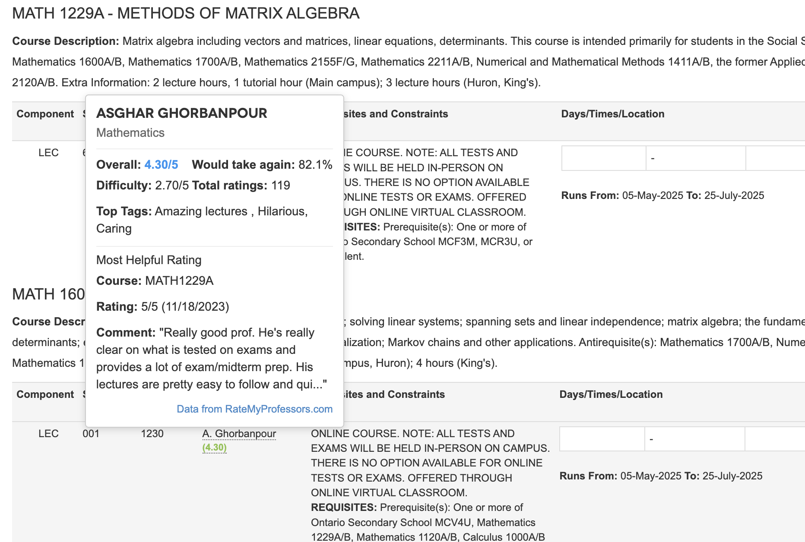
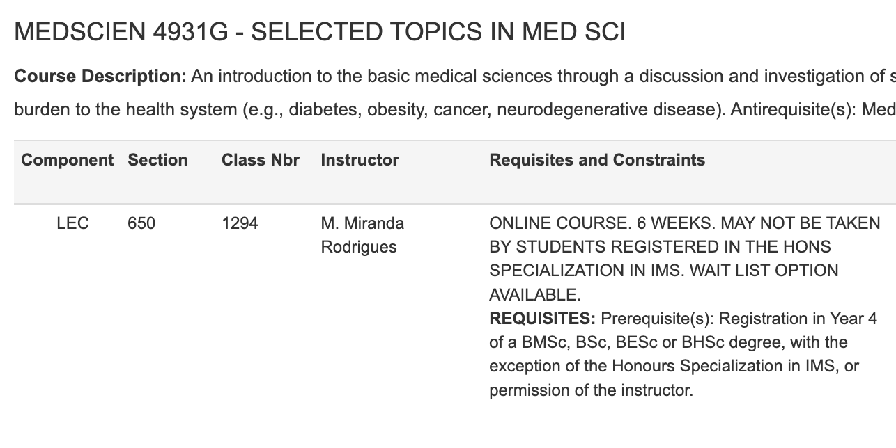

# WesternRMP

[Chrome Web Store listing!](https://chromewebstore.google.com/detail/westernrmp/kadicmbbohhejeaooldihbejljmghfbf)

Chrome extension showing Rate My Professors information in Western University's DraftMySchedule.

Thanks to Mohammad Mahfooz for the inspiration!

## Features

- **Professor Ratings**: Displays professor ratings directly in DraftMySchedule.
- **Interactive Tooltips**: Hover over professor names to see detailed information, including average ratings, difficulty scores, top tags, the most helpful review, and a direct link to the professor's full profile.
- **Department Matching**: Smart matching of professors to their departments ensures the right professor is found.

## Stack

JS for core extension functionality. Uses RateMyProfessors.com's GraphQL API: https://www.ratemyprofessors.com/graphql. Background script is used as a proxy to fetch data from the RMP API; gets around CORS restriction preventing requests from content script.

## Screenshots

The extension adds the average rating below the professor's name. Hovering over the name brings up a tooltip, with more information and a link to the professor's RMP page.

If a professor is not found, the name is displayed as normal.

## Privacy Policy

This extension does not collect, store, or transmit any personal user data.

The extension makes requests to RateMyProfessors.com's GraphQL API to fetch professor ratings and reviews. All data is processed locally in your browser and is not stored beyond your current browsing session. The extension only requests the minimum permissions needed to function - access to DraftMySchedule pages and the RateMyProfessors API.

## Other

If you'd like to adapt this extension for use with your university's schedule builder, you'll need to change the school ID to your school's RMP ID, as well as modify document query selectors to select the professor names within your builder. Western's builder displays the first name initial and full last name, and my logic is built around this. You may need to play with some functions according to how names are displayed in your portal.
